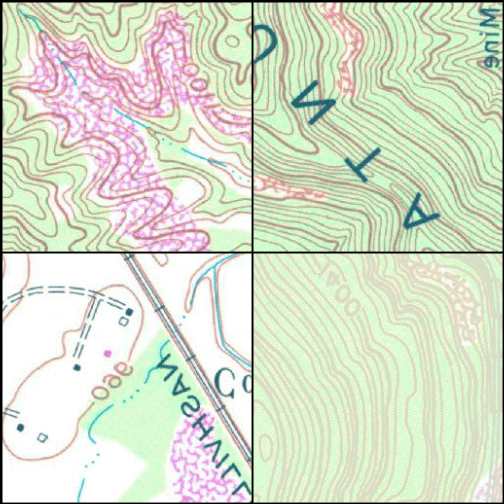
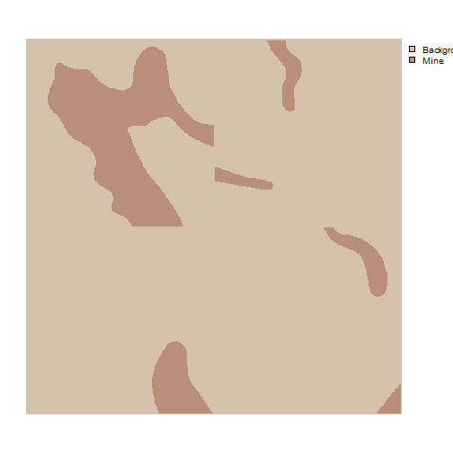

```{r setup, include=FALSE}
knitr::opts_chunk$set(echo=TRUE, comment="", collapse=TRUE, warning=FALSE, message=FALSE, fit.cap="")
```

```r
library(geodl)
```
## Background

In order to train and validate deep learning models using **torch**, input data must be converted into tensors (i.e., multidimensional arrays) with the correct dimensionality and data types. These tensors need to then be provided to the algorithm as mini-batches, since algorithms are trained incrementally on subsets of the available training set. During the training loop, data within each training mini-batch will be predicted. These predictions will then be compared to the reference labels to calculate a loss (and, optionally, additional assessment metrics). Once the loss is calculated, backpropagation is performed and the model parameters are updated using an optimization algorithm, such as stochastic gradient descent, RMSProp, or Adam.

In the **torch** environment, how a single image chip is processed is defined by a **DataSet** subclass. Specifically, the *.getitem()* method defines how a single input sample is processed to a tensor. The **DataLoader** is responsible for using the DataSet subclass to generate a mini-batch of samples to pass to the algorithm during the training or validation process.

DataSets and DataLoaders are used for preparing training, validation, and testing datasets. As a result, they are an important component of the **torch** workflow. **geodl** provides the *defineSegDataSet()* function for processing input data. An instantiated DataSet generated with this function can then be passed to **torch's** default DataLoader class.

The *defineSegDataSet()* function from **geodl** instantiates a subclass of *torch::dataset()* for geospatial semantic segmentation. This function is specifically designed to load data generated using the *makeChips()* or *makeChipsMultiClass()* function. It accepts a data frame created with the *makeChipsDF()* function.

It can also define random augmentations to combat overfitting. Note that horizontal and vertical flips will impact the alignment of the image chip and associated mask. As a result, the same augmentation will be applied to both the image and the mask. Changes in brightness, contrast, gamma, hue, and saturation are not applied to the masks since alignment is not impacted by these transformations. Predictor variables are generated with three dimensions (channel/variable, width, height) regardless of the number of channels/variables. Masks are generated as three dimensional tensors (class index, width, height).

In this example, we step through how to prepare data for input into a modeling workflow. The general workflow is as follows:

1. Create raster masks from vector geospatial data (*makeMasks()*)
2. Create chips from input predictor variables and raster masks (*makeChips()* or *makeChipsMultiClass()*)
3. List generated chips into a data frame (*makeChipsDF()*)
4. Obtain summary statistics/info for chips and associated masks (*desribeChips()*)
5. Optional: View example subset of image chips (*viewChips()*)
6. Define a DataSet and any desired augmentations (*defineSegDataSet()*)
7. Define a DataLoader (*torch::dataloader()*)
8. Optional: Check a mini-batch of chips (*desribeBatch()*)
9. Optional: View a mini-batch of chips (*viewBatch()*)

## Workflow

Since the processes of creating masks and image chips are described in other articles, we will begin here with creating the chips data frame. The *makeChipsDF()* function requires (1) an input *folder* path where the chips are saved and (2) a *mode* (either "All", "Divided", or "Positive"). In our example, we are using the "Positive" *mode* so that only chips with at least one pixel mapped to the positive class are listed. You can also choose to save the data frame to a CSV file and write it to disk and shuffle the rows to reduce autocorrelation. In our example, we are not writing the data frame out to a CSV file and not shuffling the rows. Shuffling is not necessary in this case because the data are already randomly sequenced.

You can use the *head()* function to view the first few rows of the table.


```r
chpDF <- makeChipsDF(folder = "C:/myFiles/data/toChipBinary/chips/",
                     outCSV = "C:/myFiles/data/toChipBinary/chips/chipsDF.csv",
                     extension = ".tif",
                     mode="Positive",
                     shuffle=FALSE,
                     saveCSV=FALSE)
```


```r
head(chpDF)
                chpN                    chpPth                   mskPth
1    topoOut_1_1.tif    images/topoOut_1_1.tif    masks/topoOut_1_1.tif
2 topoOut_1_1793.tif images/topoOut_1_1793.tif masks/topoOut_1_1793.tif
3 topoOut_1_2049.tif images/topoOut_1_2049.tif masks/topoOut_1_2049.tif
4 topoOut_1_2305.tif images/topoOut_1_2305.tif masks/topoOut_1_2305.tif
5  topoOut_1_257.tif  images/topoOut_1_257.tif  masks/topoOut_1_257.tif
6 topoOut_1_2817.tif images/topoOut_1_2817.tif masks/topoOut_1_2817.tif
```

Once the chips have been listed into a data frame, they can be described with the *describeChips()* function. This can be useful for checking for issues, obtaining statistical for data normalization, or estimating class proportions to implement weighted loss functions. To speed up the calculations, it is recommend to use a random subset of chips and a random subset of pixels per chip.


```r
chpDescript <- describeChips(folder= "C:/myFiles/data/toChipBinary/chips/",
                             extension = ".tif",
                             mode = "Positive",
                             subSample = TRUE,
                             numChips = 100,
                             numChipsBack = 100,
                             subSamplePix = TRUE,
                             sampsPerChip = 400)
```


```r
print(chpDescript)
$ImageStats
   vars     n   mean    sd median trimmed   mad min max range  skew kurtosis   se
B1    1 40000 213.95 34.14    219  217.71 32.62   0 255   255 -1.20     2.46 0.17
B2    2 40000 205.13 51.06    226  212.01 41.51   0 255   255 -0.95    -0.06 0.26
B3    3 40000 162.87 51.13    169  163.69 41.51   0 255   255 -0.21    -0.29 0.26

$mskStats
# A tibble: 2 × 2
  value     cnt
  <dbl>   <dbl>
1     0 5366555
2     1 1187045
```

Once the chips have been listed into a data frame and described, you are ready to define a DataSet using *defineSegDataSet()*. This function has many parameters, many of which relate to data augmentations. Here is a description of the parameters:

* *chpDF*: Data frame of image chip and mask paths created using *makeChipsDF()*.
* *folder*: Full path or path relative to the working directory to the folder containing the image chips and associated masks. You must include the final forward slash in the path (e.g., "C:/data/chips/").
* *normalize*: TRUE or FALSE. Whether to apply normalization. If FALSE, *bMns* and *bSDs* are ignored. Default is FALSE. If TRUE, you must provide *bMns* and *bSDs*.
* *rescaleFactor*: A rescaling factor to rescale the bands to 0 to 1. For example, this could be set to 255 to rescale 8-bit data. Default is 1 or no rescaling.
* *mskRescale*: Can be used to rescale binary masks that are not scaled from 0 to 1. For example, if masks are scaled from 0 and 255, you can divide by 255 to obtain a 0 to 1 scale. Default is 1 or no rescaling.
* *mskAdd*: Value to add to mask class numeric codes. For example, if class indices start are 0, 1 can be added so that indices start at 1. Default is 0 (return original class codes). Note that several other functions in this package have a *zeroStart* parameter. If class codes start at 0, this parameter should be provided an argument of TRUE. If they start at 1, this parameter should be provided an argument of FALSE. The importance of this arises from the use of one-hot encoding internally, which requires that class indices start at 1.
* *bands*: Vector of bands to include. The default is to only include the first 3 bands. If you want to use a different subset of bands, you must provide a vector of band indices here to override the default.
* *bMns*: Vector of band means. Length should be the same as the number of bands. Normalization is applied before any rescaling within the function.
* *bSDs*: Vector of band standard deviations. Length should be the same as the number of bands. Normalization is applied before any rescaling.
* *doAugs*: TRUE or FALSE. Whether or not to apply data augmentations to combat overfitting. If FALSE, all augmentations parameters are ignored. Data augmentations are generally only applied to the training set. Default is FALSE.
*maxAugs*: 0 to 7. Maximum number of random augmentations to apply. Default is 0 or no augmentations. Must be changed if augmentations are desired.
* *probVFlip*: 0 to 1. Probability of applying vertical flips. Default is 0 or no augmentations. Must be changed if augmentations are desired.
* *probHFlip*: 0 to 1. Probability of applying horizontal flips. Default is 0 or no augmentations. Must be changed if augmentations are desired.
* *probBrightness*: 0 to 1. Probability of applying brightness augmentation. Default is 0 or no augmentations. Must be changed if augmentations are desired.
* *probContrast*: 0 to 1. Probability of applying contrast augmentations. Default is 0 or no augmentations. Must be changed if augmentations are desired.
* *probGamma*: 0 to 1. Probability of applying gamma augmentations. Default is 0 or no augmentations. Must be changed if augmentations are desired.
* *probHue*: 0 to 1. Probability of applying hue augmentations. Default is 0 or no augmentations. Must be changed if augmentations are desired.
* *probSaturation*: 0 to 1. Probability of applying saturation augmentations. Default is 0 or no augmentations. Must be changed if augmentations are desired.
* *brightFactor*: Vector of smallest and largest brightness adjustment factors. Random value will be selected between these extremes. The default is 0.8 to 1.2. Can be any non-negative number. For example, 0 gives a black image, 1 gives the original image, and 2 increases the brightness by a factor of 2.
* *contrastFactor*: Vector of smallest and largest contrast adjustment factors. Random value will be selected between these extremes. The default is 0.8 to 1.2. Can be any non negative number. For example, 0 gives a solid gray image, 1 gives the original image, and 2 increases the contrast by a factor of 2.
* *gammaFactor*: Vector of smallest and largest gamma values and gain value for a total of 3 values. Random value will be selected between these extremes. The default gamma value range is 0.8 to 1.2 and the default gain is 1. The gain is not randomly altered, only the gamma. Non negative real number. A gamma larger than 1 makes the shadows darker while a gamma smaller than 1 makes dark regions lighter.
* *hueFactor*: Vector of smallest and largest hue adjustment factors. Random value will be selected between these extremes. The default is -0.2 to 0.2. Should be in range -0.5 to 0.5. 0.5 and -0.5 give complete reversal of hue channel in HSV space in positive and negative direction, respectively. 0 means no shift. Therefore, both -0.5 and 0.5 will give an image with complementary colors while 0 gives the original image.
* *saturationFactor*: Vector of smallest and largest saturation adjustment factors. Random value will be selected between these extremes. The default is 0.8 to 1.2. For example, 0 will give a black-and-white image, 1 will give the original image, and 2 will enhance the saturation by a factor of 2.

In our example, the data are being normalized, and we have provided band means and standard deviations, which were estimated using the *desribeChips()* function. We are also rescaling the data by a factor of 255. This is because the data are currently represented as 8-bit integer values as opposed to 32-bit float values scaled from 0 to 1.

Augmentations are also being performed. A maximum of 2 augmentations will be applied per chip. Vertical flips, horizontal flips, brightness changes, and saturation changes will be considered. The flips have a 30% probability of being applied while the brightness and saturation changes have a 10% chance of being applied. We often struggle with determining the appropriate amount of data augmentations to apply. We tend to conservatively apply augmentations; however, others may disagree.

Not all augmentations are appropriate for all data types. For example, saturation and hue adjustments are only applicable to RGB data.


```r
myDS <- defineSegDataSet(chpDF,
                         folder="C:/myFiles/data/toChipBinary/chips/",
                         normalize = TRUE,
                         rescaleFactor = 255,
                         mskRescale=1,
                         mskAdd=1,
                         bands = c(1,2,3),
                         bMns=c(214,206,163),
                         bSDs=c(33,50,51),
                         doAugs = TRUE,
                         maxAugs = 2,
                         probVFlip = .3,
                         probHFlip = .3,
                         probBrightness = .1,
                         probContrast = 0,
                         probGamma = 0,
                         probHue = 0,
                         probSaturation = .1,
                         brightFactor = c(.8,1.2),
                         contrastFactor = c(.8,1.2),
                         gammaFactor = c(.8, 1.2, 1),
                         hueFactor = c(-.2, .2),
                         saturationFactor = c(.8, 1.2))
```

Once the DataSet is defined, it can be fed to the *dataloader()* function from **torch**. Again, the purpose of the DataLoader is to generate mini-batches of data during the training or inference processes. In our example, a mini-batch size of 4 is being used. The maximum possible mini-batch size will depend on several factors including (1) the complexity of the model, (2) the number of rows and columns of pixels in each chip, (3) the number of channels in each chip, and (4) the available hardware. Training on multiple GPUs allows for using a larger mini-batch size. However, studies have shown that using a large mini-batch size can result in overfitting or more sensitivity to changes in the learning rate. As a result, we generally use smaller mini-batch sizes.

In our example, we are also randomly shuffling the data in an attempt to further reduce autocorrelation. The last mini-batch is being dropped. This is because, unless the number of available chips is perfectly divisible by the mini-batch size, the last mini-batch will be smaller than the other mini-batches. This can result in issues with loss and assessment metric calculations. So, we generally recommend dropping the last mini-batch unless the total number of chips is evenly divisible by the mini-batch size.


```r
myDL <- torch::dataloader(myDS,
                          batch_size=4,
                          shuffle=TRUE,
                          drop_last = TRUE)
```

Once a DataSet and DataLoader have been instantiated, you are ready to define and initialize a training loop. This process will be explored in other articles.

Optionally, you can check your data by (1) plotting a mini-batch of chips and associated masks with the *viewBatch()* function and/or (2) obtaining summary info for a single mini-batch using the *describeBatch()* function. We generally recommend running these checks. We recommend considering the following as you review the data:

1. Each mini-batch of images or predictor variables should have a shape of (Mini-Batch, Channels, Width, Height).
2. Each mini-batch of masks should have a shape of (Mini-Batch, Class, Width, Height).
3. Each image should have a shape of (Channels, Width, Height) and a 32-bit float data type,
4. Each mask should have a shape of (Class, Width, Height) and have a long integer data type.
5. The number of channels and rows and columns of pixels should match the data being used.
6. If you specified a subset of bands, the number of channels should match your subset.
7. The range of values in the image bands should be as expected, such as 0 to 1.
8. The range of class indices should be as expected. Note whether class codes start at 0 or 1.
9. Viewing a mini-batch can help you visualize the augmentations being applied and whether or not they are too extreme or too subtle.
10. Viewing the mini-batch can help you determine if there are any oddities with the data, such as the predictor variables and masks not aligning or the bands being in the incorrect order.


```r
viewBatch(dataLoader=myDL,
          nCols = 2,
          r = 1,
          g = 2,
          b = 3,
          cNames=c("Background", "Mine"),
          cColor=c("#D4C2AD","#BA8E7A")
          )
```

{width=60%}

{width=60%}


```r
myBatchStats <- describeBatch(dataLoader=myDL,
                              zeroStart=FALSE)
```


```r
print(myBatchStats)
$batchSize
[1] 4

$imageDataType
[1] "Float"

$maskDataType
[1] "Long"

$imageShape
[1] "4"   "3"   "256" "256"

$maskShape
[1] "4"   "1"   "256" "256"

$bndMns
[1] -0.0004852064 -0.0005571313 -0.0006161333

$bandSDs
[1] 0.004172502 0.004146057 0.003736094

$maskCount
[1] 200514  61630

$minIndex
[1] 1

$maxIndex
[1] 2
```
