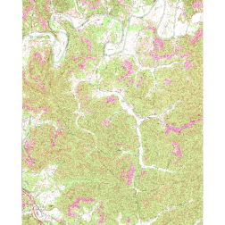

```{r setup, include=FALSE}
knitr::opts_chunk$set(echo=TRUE, comment="", collapse=TRUE, warning=FALSE, message=FALSE, fit.cap="")
```

```r
library(geodl)
```
When working with geospatial data, it is common for features to be stored as vector data as opposed to categorical raster data. However, deep learning semantic segmentation requires raster-based labels where each unique class is assigned a unique numeric code. The purpose of the *makeMasks()* function is to generate raster masks from input vector data. It can also generate a copy of the reference raster data and allow for the output mask and image to be cropped relative to a defined extent. The parameters for this function are as follows:

* *image*: Input image, either spatRaster object or the path to an image on disk. This image serves as a reference for generating the raster mask. The resulting categorical raster will have the same spatial resolution and spatial extent as the reference image and will align perfectly with it.
* *features*: Either a spatVector object, sf object, or the path to a vector geospatial layer on disk. Note that features must be polygons as opposed to point or line features. Point or line features can be buffered to generate polygons prior to attempting to generate masks.
* *crop*: whether or not to crop the output raster mask and/or image to a defined extent.
* *extent*: Either a spatVector or sf object or the path to a vector geospatial layer on disk that defines the cropping extent for the output data. This must be a polygon feature.
* *field*: the attribute column name that specifies the unique values for the different classes. Classes should be differentiated as contiguous numeric integers (0 through *n*-1 or 1 through *n* where *n* is the number of classes).
* *background*: Integer value to assign to the background or unlabeled class. This is generally 0. For a binary classification the background should be labeled as 0 and the positive case should be labelled as 1.
* *outImage*: File path and name of the output image. You must include the file extension. We recommend either .tif or .img.
* *outMask*: File path and name of the output raster mask. You must include the file extension. We recommend either .tif or .img.
* *mode*: Either "Both" or "Mask". If "Both", the mask and a copy of the input image is saved. If "Mask", only the mask is saved. It can be useful to use "Both" if you are applying cropping so that the image and mask remain perfectly aligned and have the same spatial resolution and number of rows and columns of cells.
In the example below, I am creating raster masks representing mine disturbance extents for a topographic map included in the topoDL dataset. I have provided the mine extent features as a polygon vector layer saved as a shapefile. The cropping extent also reference a shapefile. Since I am using the "Both" *mode*, both the raster mask and cropped image are saved to disk.


```r
makeMasks(image = "C:/myFiles/data/toChipBinary/image/KY_Saxton_709705_1970_24000_geo.tif",
          features = "C:/myFiles/data/toChipBinary/msks/KY_Saxton_709705_1970_24000_geo.shp",
          crop = TRUE,
          extent = "C:/myFiles/data/toChipBinary/extent/KY_Saxton_709705_1970_24000_geo.shp",
          field = "classvalue",
          background = 0,
          outImage = "C:/myFiles/data/toChipBinary/output/topoOut.tif",
          outMask = "C:/myFiles/data/toChipBinary/output/mskOut.tif",
          mode = "Both")
```

The *plotRGB()* function from the **terra** package can be used to visualized the cropped topographic map since it is an RGB or three-band file. In contrast, the raster mask can be visualized with *plot()* since it consists of only a single band.


```r
terra::plotRGB(terra::rast("C:/myFiles/data/toChipBinary/output/topoOut.tif"))
```

{width=60%}

```r
terra::plot(terra::rast("C:/myFiles/data/toChipBinary/output/mskOut.tif"))
```

{width=60%}
