```{r setup, include=FALSE}
knitr::opts_chunk$set(echo=TRUE, comment="", collapse=TRUE, warning=FALSE, message=FALSE, fit.cap="")
```


```r
library(geodl)
library(dplyr)
library(torch)
library(luz)
library(ggplot2)
```

```r
device <- torch_device("cuda")
```

The goal of this article is to provide an example of a complete workflow for a multiclass classification. We use the [landcover.ai](https://landcover.ai.linuxpolska.com/) datasets, which consists of high spatial resolution aerial orthophotography for areas across Poland. The associated labels differentiate five classes: Background, Buildings, Woodland, Water, and Road. The required data have been provided if you would like to execute the entire workflow. Training this model requires a GPU, and it will take several hours to train the model. We have provided a trained model file if you would like to experiment with the code without training a model from scratch.

## Preparation

The data originators have provides TXT files listing the image chips into separate training, validation, and testing datasets. So, we first read in these lists as data frames. The data lists are not in the correct format for **geodl's** *defineSegDataset()* function, which requires that the following columns are present: "chpN", "chpPth", and "mskPth". The "chpN" column must provides the name of the chip, and the "chpPth" and "MskPth" columns must provide the path to the image and associated mask chips relative to the folder that houses the chips. Using **dplyr**, we create data frames in this correct format from the provided tables. The mask files have the suffix "_m" added, so we also must add this suffix to the image name when defining the associated mask.

Lastly, we randomly select out 3,000 training, 500 validation, and 500 testing chips to speed up the training and inference processes for this demonstration.


```r
testDF <- read.csv("C:/myFiles/data/landcoverai/test.txt", header=FALSE)
trainDF <- read.csv("C:/myFiles/data/landcoverai/train.txt", header=FALSE)
valDF <-  read.csv("C:/myFiles/data/landcoverai/val.txt", header=FALSE)
```


```r
trainDF <- data.frame(chpN=trainDF$V1,
                      chpPth=paste0("images/", trainDF$V1, ".tif"),
                      mskPth=paste0("masks/", trainDF$V1, "_m.tif")) |>
  sample_frac(1, replace=FALSE) |> sample_n(3000)

testDF <- data.frame(chpN=testDF$V1,
                     chpPth=paste0("images/", testDF$V1, ".tif"),
                     mskPth=paste0("masks/", testDF$V1, "_m.tif")) |>
  sample_frac(1, replace=FALSE) |> sample_n(500)

valDF <- data.frame(chpN=valDF$V1,
                    chpPth=paste0("images/", valDF$V1, ".tif"),
                    mskPth=paste0("masks/", valDF$V1, "_m.tif"))  |>
  sample_frac(1, replace=FALSE) |> sample_n(500)
```

As a check, I next view a randomly selected set of 25 chips using the *viewChips()* function.


```r
viewChips(chpDF=trainDF,
          folder="C:/myFiles/data/landcoverai/train/",
          nSamps = 25,
          mode = "both",
          justPositive = FALSE,
          cCnt = 5,
          rCnt = 5,
          r = 1,
          g = 2,
          b = 3,
          rescale = FALSE,
          rescaleVal = 1,
          cNames= c("Background", "Buildings", "Woodland", "Water", "Road"),
          cColors= c("gray", "red", "green", "blue", "black"),
          useSeed = TRUE,
          seed = 42)
```

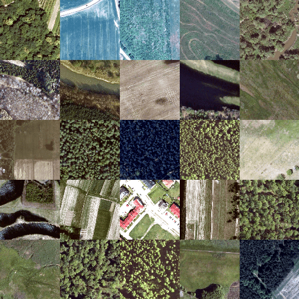{widtth=60%}
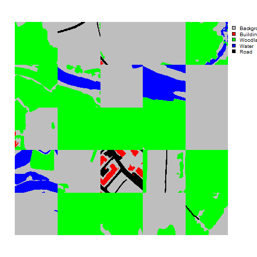{widtth=60%}

I am now ready to define the training and validation datasets. Here are a few key points:

1. I am not normalizing the data, so do not need to provide band means and standard deviations.
2. The images are scaled from 0 to 255 (8-bit), so I rescale the data from 0 to 1 using a *rescaleFactor()* of 255. The masks do not need to be rescaled. I also set *mskAdd* to 1 so that the class codes will begin at 1 instead of 0.
3. Lastly, I apply a maximum of 1 augmentation per chip. The augmentations used are random vertical flips, horizontal flips, brightness changes, and saturation changes. Horizontal and vertical flips have a 50% chance of being randomly applied, brightness changes have a 10% chance of being applied, and saturation changes have a 20% chance of being applied.

I use the same settings for the training and validation datasets other than not applying random augmentations for the validation data.


```r
trainDS <- defineSegDataSet(
  chpDF=trainDF,
  folder="C:/myFiles/data/landcoverai/train/",
  normalize = FALSE,
  rescaleFactor = 255,
  mskRescale= 1,
  bands = c(1,2,3),
  mskAdd=1,
  doAugs = TRUE,
  maxAugs = 1,
  probVFlip = .5,
  probHFlip = .5,
  probBrightness = .1,
  probContrast = 0,
  probGamma = 0,
  probHue = 0,
  probSaturation = .2,
  brightFactor = c(.9,1.1),
  contrastFactor = c(.9,1.1),
  gammaFactor = c(.9, 1.1, 1),
  hueFactor = c(-.1, .1),
  saturationFactor = c(.9, 1.1))

valDS <- defineSegDataSet(
  chpDF=valDF,
  folder="C:/myFiles/data/landcoverai/val/",
  normalize = FALSE,
  rescaleFactor = 255,
  mskRescale = 1,
  mskAdd=1,
  bands = c(1,2,3),
  doAugs = FALSE,
  maxAugs = 0,
  probVFlip = 0,
  probHFlip = 0)
```

Next, a print the length of the datasets to make sure the number of samples are as expected.


```r
length(trainDS)
[1] 3000
length(valDS)
[1] 500
```

Now that I have datasets defined, I generate DataLoaders using the *dataloader()* function from **torch**. I use a mini-batch size of 15. You may need to change the mini-batch size depending on your computer's hardware. The training data are shuffled to reduce autocorrelation; however, the validation data are not. I drop the last mini-batch for both the training and validation data.


```r
trainDL <- torch::dataloader(trainDS,
                             batch_size=15,
                             shuffle=TRUE,
                             drop_last = TRUE)

valDL <- torch::dataloader(valDS,
                           batch_size=15,
                           shuffle=FALSE,
                           drop_last = TRUE)
```

As checks, I next view a batch of the training and validation data using the *viewBatch()* function. I also use *describeBatch()* to obtain summary info for a mini-batch. Here are a few points to consider.

1. Each mini-batch of images should have a shape of (Mini-Batch, Channels, Width, Height).
2. Each mini-batch of masks should have a shape of (Mini-Batch, Class, Width, Height).
3. Each image should have a shape of (Channels, Width, Height) and a 32-bit float data type,
4. Each mask should have a shape of (Class, Width, Height) and have a long integer data type.
5. The number of channels and rows and columns of pixels should match the data being used.
6. If you specified a subset of bands, the number of channels should match your subset.
7. The range of values in the image bands should be as expected, such as 0 to 1.
8. The range of class indices should be as expected. Note whether class codes start at 0 or 1.
9. Viewing a mini-batch can help you visualize the augmentations being applied and whether or not they are too extreme or too subtle.
10. Viewing the mini-batch can help you determine if there are any oddities with the data, such as the predictor variables and masks not aligning or the bands being in the incorrect order.


```r
viewBatch(dataLoader=trainDL,
          nCols = 5,
          r = 1,
          g = 2,
          b = 3,
          cNames=c("Background", "Buildings", "Woodland", "Water", "Road"),
          cColors=c("gray", "red", "green", "blue", "black"))
```

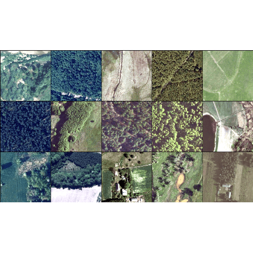{widtth=60%}
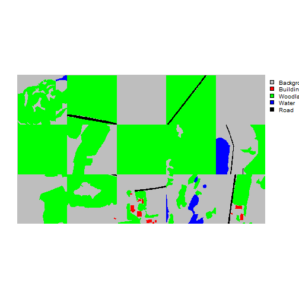{widtth=60%}


```r
viewBatch(dataLoader=valDL,
          nCols = 5,
          r = 1,
          g = 2,
          b = 3,
          cNames=c("Background", "Buildings", "Woodland", "Water", "Road"),
          cColors=c("gray", "red", "green", "blue", "black"))
```

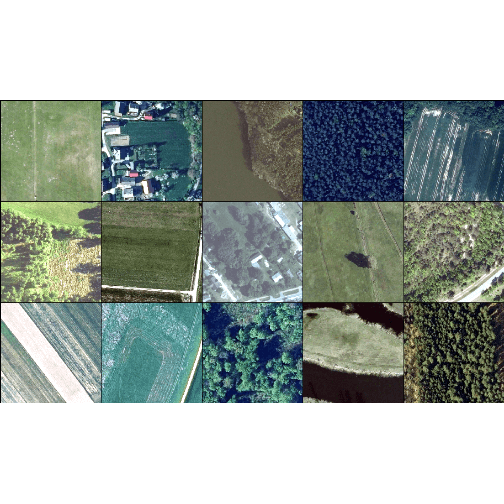{widtth=60%}
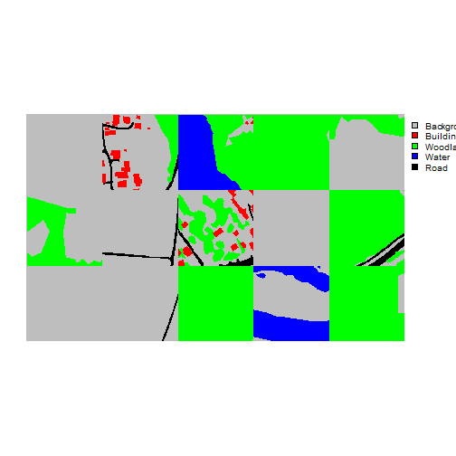{widtth=60%}


```r
trainStats <- describeBatch(trainDL,
                            zeroStart=FALSE)
valStats <- describeBatch(valDL,
                          zeroStart=FALSE)
```


```r
print(trainStats)
$batchSize
[1] 15

$imageDataType
[1] "Float"

$maskDataType
[1] "Long"

$imageShape
[1] "15"  "3"   "512" "512"

$maskShape
[1] "15"  "1"   "512" "512"

$bndMns
[1] 0.3979441 0.4192438 0.3617396

$bandSDs
[1] 0.1630734 0.1325573 0.1078829

$maskCount
[1] 2618263   14723 1063879   15848  219447

$minIndex
[1] 1

$maxIndex
[1] 5
print(valStats)
$batchSize
[1] 15

$imageDataType
[1] "Float"

$maskDataType
[1] "Long"

$imageShape
[1] "15"  "3"   "512" "512"

$maskShape
[1] "15"  "1"   "512" "512"

$bndMns
[1] 0.3086319 0.3634965 0.3161972

$bandSDs
[1] 0.1500528 0.1296813 0.1046080

$maskCount
[1] 2183194   53566 1374415  259548   61437

$minIndex
[1] 1

$maxIndex
[1] 5
```

## Configure and Train Model with luz

We are now ready to configure and train a model. This is implemented using the **luz** package, which greatly simplifies the **torch** training loop. Here are a few key points.

1. A UNet model with a MobileNet-v2 encoder is defined using the *defineMobileUNet()* function. Note that this implementation only accepts three-band inputs data.
2. A **focal Dice loss** is implemented with *defineUnifiedFocalLoss()* by setting *lambda* to 0, *gamma* to 0.8, and *delta* to 0.5.
3. We set the *zeroStart* argument to FALSE since the class codes were set start at 1 using *defineSegDataSet()*.
4. The loss metric and all assessment metrics are configured to expect 5 classes.
5. The AdamW optimizer is used.
6. The UNet parameterization is configured using *set_hparams()*. The architecture is configured to generate an output logit for all 5 classes (*nCls* = 5). We are using the leaky ReLU activation function (*actFunc* = "lrelu") with a negative slope term of 0.01 (*negative_slop* = 0.01) instead of the more common ReLU. We are using attention gates but not deep supervision. Decoder blocks 1 through 5 will output 256, 128, 64, 32, and 16 feature maps, respectively.
7. The learning rate is set to 1e-3 using the *set_opt_hparams()* function from **luz**.
8. Using *fit()* from **luz**, we specify the training (*data*) and validation (*valid_data*) DataLoaders to use. We train the model for 10 epochs, save the logs out to disk as a CSV file, and only save the model checkpoint if the validation loss improves. We also specify that the GPU will be used for training.

Again, if you want to run this code, expect it to take several hours. A CUDA-enabled GPU is required.


```r
fitted <- defineMobileUNet |>
  luz::setup(
    loss = defineUnifiedFocalLoss(nCls=5,
                                    lambda=0,
                                    gamma=.8,
                                    delta=0.5,
                                    smooth = 1,
                                    zeroStart=FALSE,
                                    clsWghtsDist=1,
                                    clsWghtsReg=1,
                                    useLogCosH =FALSE,
                                    device=device),
    optimizer = optim_adamw,
    metrics = list(
      luz_metric_overall_accuracy(nCls=5,
                                  smooth=1,
                                  mode="multiclass",
                                  zeroStart=FALSE,
                                  usedDS=FALSE),
      luz_metric_f1score(nCls=5,
                         smooth=1,
                         mode="multiclass",
                         zeroStart=FALSE,
                         clsWghts=c(1,1,1,1,1),
                         usedDS=FALSE),
      luz_metric_recall(nCls=5,
                         smooth=1,
                         mode="multiclass",
                         zeroStart=FALSE,
                        clsWghts=c(1,1,1,1,1),
                         usedDS=FALSE),
      luz_metric_precision(nCls=5,
                         smooth=1,
                         mode="multiclass",
                         zeroStart=FALSE,
                         clsWghts=c(1,1,1,1,1),
                         usedDS=FALSE)
    )
  ) |>
  set_hparams(
    nCls = 5,
    pretrainedEncoder = TRUE,
    freezeEncoder = FALSE,
    actFunc = "lrelu",
    useAttn = TRUE,
    useDS = FALSE,
    dcChn = c(256,128,64,32,16),
    negative_slope = 0.01
  ) |>
  set_opt_hparams(lr = 1e-3) |>
  fit(data=trainDL,
      valid_data=valDL,
      epochs = 10,
      callbacks = list(luz_callback_csv_logger("C:/myFiles/data/landcoverai/models/trainLogs.csv"),
                       luz_callback_model_checkpoint(path="data/landcoverai/models/",
                                                     monitor="valid_loss",
                                                     save_best_only=TRUE,
                                                     mode="min",
                       )),
      accelerator = accelerator(device_placement = TRUE,
                                cpu = FALSE,
                                cuda_index = torch::cuda_current_device()),
      verbose=TRUE)
```

## Assess Model

Once the model is trained, it should be assessed using the withheld testing set. To accomplish this, we first re-instantiate the model using **luz** and by loading the saved checkpoint. In *fit()*, we set the argument for *epoch* to 0 so that the model object is instantiated but no training is conducted. We then load the saved checkpoint using *luz_load_checkpoint()*.


```r
fitted <- defineMobileUNet |>
  luz::setup(
    loss = defineUnifiedFocalLoss(nCls=5,
                                  lambda=0,
                                  gamma=.8,
                                  delta=0.5,
                                  smooth = 1,
                                  zeroStart=FALSE,
                                  clsWghtsDist=1,
                                  clsWghtsReg=1,
                                  useLogCosH =FALSE,
                                  device=device),
    optimizer = optim_adamw,
    metrics = list(
      luz_metric_overall_accuracy(nCls=5,
                                  smooth=1,
                                  mode="multiclass",
                                  zeroStart=FALSE,
                                  usedDS=FALSE),
      luz_metric_f1score(nCls=5,
                         smooth=1,
                         mode="multiclass",
                         zeroStart=FALSE,
                         clsWghts=c(1,1,1,1,1),
                         usedDS=FALSE),
      luz_metric_recall(nCls=5,
                        smooth=1,
                        mode="multiclass",
                        zeroStart=FALSE,
                        clsWghts=c(1,1,1,1,1),
                        usedDS=FALSE),
      luz_metric_precision(nCls=5,
                           smooth=1,
                           mode="multiclass",
                           zeroStart=FALSE,
                           clsWghts=c(1,1,1,1,1),
                           usedDS=FALSE)
    )
  ) |>
  set_hparams(
    nCls = 5,
    pretrainedEncoder = TRUE,
    freezeEncoder = FALSE,
    actFunc = "lrelu",
    useAttn = FALSE,
    useDS = FALSE,
    dcChn = c(256,128,64,32,16),
    negative_slope = 0.01
  ) |>
  set_opt_hparams(lr = 1e-3) |>
  fit(data=trainDL,
      valid_data=valDL,
      epochs = 0,
      callbacks = list(luz_callback_csv_logger("C:/myFiles/data/landcoverai/models/trainLogs.csv"),
                       luz_callback_model_checkpoint(path="data/landcoverai/models/",
                                                     monitor="valid_loss",
                                                     save_best_only=TRUE,
                                                     mode="min",
                       )),
      accelerator = accelerator(device_placement = TRUE,
                                cpu = FALSE,
                                cuda_index = torch::cuda_current_device()),
      verbose=TRUE)
```


```r
luz_load_checkpoint(fitted, "C:/myFiles/data/landcoverai/landcoveraiModel.pt")
```

We read in the saved logs from disk and plot the training and validation loss, F1-score, recall, and precision curves using **ggplot2**.


```r
allMets <- read.csv("C:/myFiles/data/landcoverai/trainLogs.csv")
```


```r
ggplot(allMets, aes(x=epoch, y=loss, color=set))+
  geom_line(lwd=1)+
  labs(x="Epoch", y="Loss", color="Set")
```

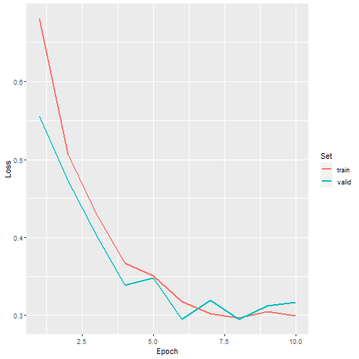{widtth=60%}


```r
ggplot(allMets, aes(x=epoch, y=f1score, color=set))+
  geom_line(lwd=1)+
  labs(x="Epoch", y="F1-Score", color="Set")
```

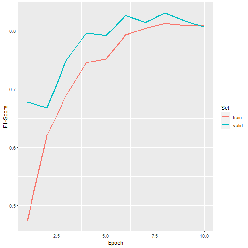{widtth=60%}


```r
ggplot(allMets, aes(x=epoch, y=recall, color=set))+
  geom_line(lwd=1)+
  labs(x="Epoch", y="Recall", color="Set")
```

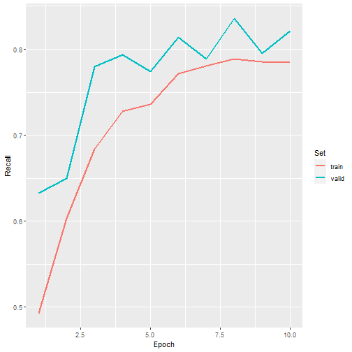{widtth=60%}


```r
ggplot(allMets, aes(x=epoch, y=precision, color=set))+
  geom_line(lwd=1)+
  labs(x="Epoch", y="Precision", color="Set")
```

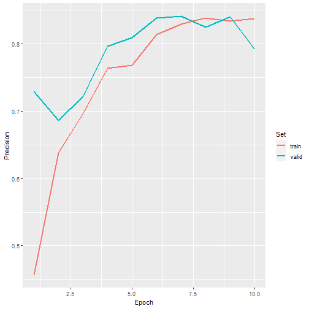{widtth=60%}

Next, we load in the test data. This requires (1) listing the chips into a data frame using *makeChipsDF()* (this was already done above), (2) defining a DataSet using *defineSegDataset()*, and (3) creating a DataLoader with *torch::dataloader()*. It is important that the dataset is defined to be consistent with the training and validation datasets used to train and validate the model during the training process.


```r
testDS <- defineSegDataSet(
  chpDF=testDF,
  folder="C:/myFiles/data/landcoverai/test/",
  normalize = FALSE,
  rescaleFactor = 255,
  mskRescale = 1,
  mskAdd=1,
  bands = c(1,2,3),
  doAugs = FALSE,
  maxAugs = 0,
  probVFlip = 0,
  probHFlip = 0)
```


```r
testDL <- torch::dataloader(testDS,
                           batch_size=15,
                           shuffle=FALSE,
                           drop_last = TRUE)
```

We can obtain the same summary metrics as used during the training process but calculated for the withheld testing data using the *evaluate()* function from **luz**. Once the evaluation is ran, the metrics can be obtained with *get_metrics()*.


```r
testEval <- fitted %>% evaluate(data=testDL)
assMets <- get_metrics(testEval)
print(assMets)
# A tibble: 5 × 2
  metric     value
  <chr>      <dbl>
1 loss       0.261
2 overallacc 0.924
3 f1score    0.837
4 recall     0.818
5 precision  0.858
```

Using **geodl**, a mini-batch of image chips, reference masks, and predictions can be plotted using *viewBatchPreds()*. Summary metrics can be obtain for the entire training dataset using *assessDL()* from **geodl**. This function generates the same set of metrics as *assessPnts()* and *assessRaster()*


```r
viewBatchPreds(dataLoader=testDL,
               model=fitted,
               mode="multiclass",
               nCols = 5,
               r = 1,
               g = 2,
               b = 3,
               cCodes=c(1,2,3,4,5),
               cNames=c("Background", "Buildings", "Woodland", "Water", "Road"),
               cColors=c("gray", "red", "green", "blue", "black"),
               useCUDA=TRUE,
               probs=FALSE,
               usedDS=FALSE)
```

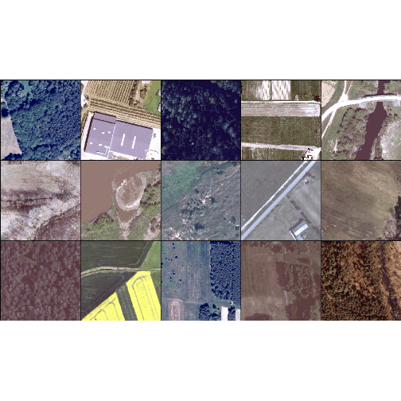{widtth=60%}
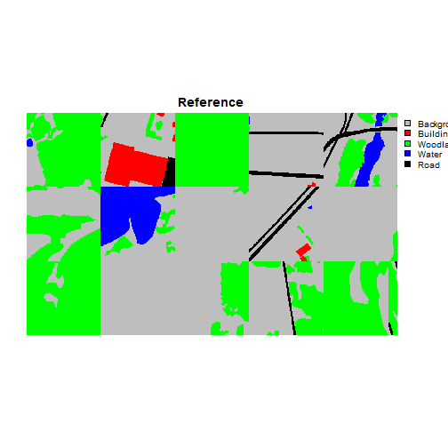{widtth=60%}
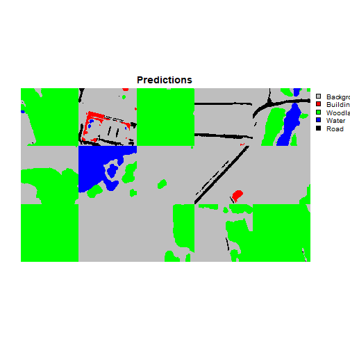{widtth=60%}


```r
testEval2 <- assessDL(dl=testDL,
                      model=fitted,
                      batchSize=12,
                      size=512,
                      nCls=5,
                      multiclass=TRUE,
                      cCodes=c(1,2,3,4,5),
                      cNames=c("Background", "Buildings", "Woodland", "water", "road"),
                      usedDS=FALSE,
                      useCUDA=TRUE)
```


```r
print(testEval2)
$Classes
[1] "Background" "Buildings"  "Woodland"   "water"      "road"      

$referenceCounts
Background  Buildings   Woodland      water       road 
  58902014    1044624    1949067    7460337   34452982 

$predictionCounts
Background  Buildings   Woodland      water       road 
  57454532     757136    1907133    7643841   36046382 

$confusionMatrix
            Reference
Predicted    Background Buildings Woodland    water     road
  Background   54573698    335542   491159   330967  1723166
  Buildings      138437    610459     6309     1716      215
  Woodland       487133     79566  1323956     1458    15020
  water          542525      2534     3345  7049758    45679
  road          3160221     16523   124298    76438 32668902

$aggMetrics
     OA macroF1 macroPA macroUA
1 0.927  0.8358  0.8167  0.8558

$userAccuracies
Background  Buildings   Woodland      water       road 
    0.9499     0.8063     0.6942     0.9223     0.9063 

$producerAccuracies
Background  Buildings   Woodland      water       road 
    0.9265     0.5844     0.6793     0.9450     0.9482 

$f1Scores
Background  Buildings   Woodland      water       road 
    0.9380     0.6776     0.6867     0.9335     0.9268 
```
