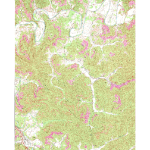
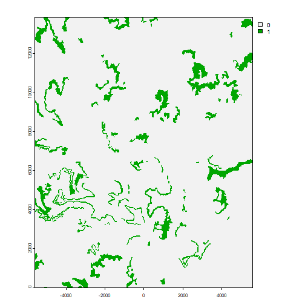
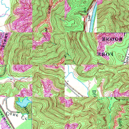
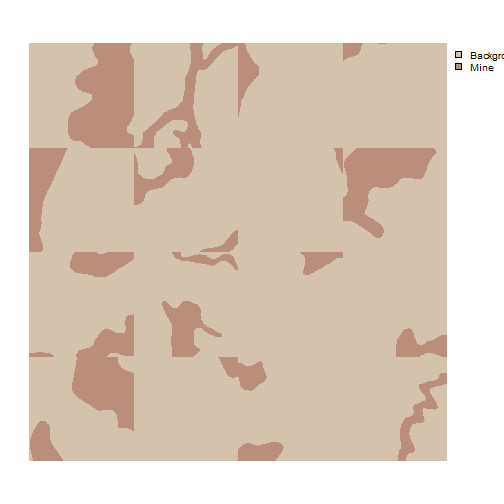
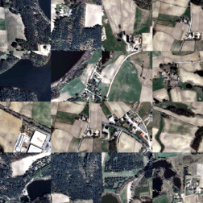
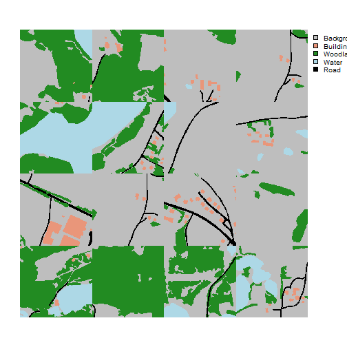

```{r setup, include=FALSE}
knitr::opts_chunk$set(echo=TRUE, comment="", collapse=TRUE, warning=FALSE, message=FALSE, fit.cap="")
```


```r
library(geodl)
library(terra)
```

Image chips serve as the unit of analysis for training and validating convolutional neural network (CNN)-based semantic segmentation models. Chips are raster or image files of a defined size (e.g., 128x128, 256x256, 512x512, etc.). For semantic segmentation, if chips will be used to train or evaluate a model, they need to also have an associated pixel-level mask where classes are differentiated using a unique numeric code. This example describes how to make, list, describe, and view image chips using **geodl**. We provide examples for both a binary classification and a multiclass classification.

## Binary Classification Example

### Step 1: Make Masks

Before generating chips, associated raster masks must be created where each pixel is assigned a numeric code differentiating the classes of interest. For a binary classification, where a single class is differentiated from the background, the background class should be assigned a value of 0 while the positive class should be assigned a value of 1.

The *makeMasks()* function generates raster masks from input geospatial vector data. This function is described in more detail in a separate article. In this example, we are generating both a raster mask and a copy of the reference image, which have been cropped to a defined extent. The background is assigned a value of 0, specified with the *background* parameter. The class code is 1, which is denoted in the "classvalue" column of the input feature attribute table.


```r
makeMasks(image = "C:/myFiles/data/toChipBinary/image/KY_Saxton_709705_1970_24000_geo.tif",
          features = "C:/myFiles/data/toChipBinary/msks/KY_Saxton_709705_1970_24000_geo.shp",
          crop = TRUE,
          extent = "C:/myFiles/data/toChipBinary/extent/KY_Saxton_709705_1970_24000_geo.shp",
          field = "classvalue",
          background = 0,
          outImage = "C:/myFiles/data/toChipBinary/output/topoOut.tif",
          outMask = "C:/myFiles/data/toChipBinary/output/mskOut.tif",
          mode = "Both")
Error: [writeRaster] file exists. You can use 'overwrite=TRUE' to overwrite it
```

The *plotRGB()* function from the **terra** package can be used to visualize the cropped image, in this case a topographic map, since it is an RGB or three-band file. In contrast, the raster mask can be visualized with *plot()* since it consists of only a single band.


```r
terra::plotRGB(terra::rast("C:/myFiles/data/toChipBinary/output/topoOut.tif"))
```

{width=60%}


```r
terra::plot(terra::rast("C:/myFiles/data/toChipBinary/output/mskOut.tif"))
```

{width=60%}

It is important that the input predictor variables or images and the associated raster masks have the same coordinate reference system, spatial extent, cell size, and number of rows and columns of pixels. The *resample()*, *project()*, and *crop()* functions from **terra** are useful for aligning raster grids.

### Step 2: Make Chips

Once raster-based predictor variables and associated pixel-level labels are available, the *makeChips()* function can be used to generate chips of a defined size. This function requires an input image (*image*), input mask (*mask*), the number of channels in the image or predictor variable stack (*n_channels*), and an output directory in which to save the chips (*outDir*).

The number of rows and columns of pixels in each chip are equal to the *size* argument. If a *stride_x* and *stride_y* are used that are different from the size argument, resulting chips will either overlap or have gaps between them. In order to not have overlap or gaps, the *stride_x* and *stride_y* arguments should be the same as the size argument. Both the image chips and associated masks are written to TIFF format (".tif"). Input data are not limited to three-band images.

This function is specifically for a binary classification where the positive case is indicated with a cell value of 1 and the background or negative case is indicated with a cell value of 0. For a multiclass classification, the *makeChipsMultiClass()* function should be used, which is demonstrated below. If an irregular shaped raster grid is provided, only chips and masks that contain no NA or NoDATA cells will be produced.

Three modes are available. If "All" is used, all image chips are generated even if they do not contain pixels mapped to the positive case. Within the provided directory, image chips will be written to an "images" folder and masks will be written to a "masks" folder. If "Positive" is used, only chips that have at least 1 pixel mapped to the positive class will be produced. Background-only chips will not be generated. Within the provided directory, image chips will be written to an "images" folder and masks will be written to a "masks" folder. Lastly, if the "Divided" method is used, separate "positive" and "background" folders will be created with "images" and "masks" subfolders. Any chip that has at least 1 pixel mapped to the positive class will be written to the "positive" folder while any chip having only background pixels will be written to the "background" folder.

It is also possible to write chips into an existing directory. This is useful if you want to create one set of chips from multiple input files or extents. You could make use for for loops to iterate over multiple input sets and write the all chips to the same folder.

In the example below, I am creating image chips for a topographic map from the topoDL dataset. Each chip will be 256x256 pixels in size, and chips will not overlap. I am only creating chips that have at least one pixel mapped to the positive case within their extent (*mode* = "Positive").


```r
makeChips(image = "C:/myFiles/data/toChipBinary/output/topoOut.tif",
          mask = "C:/myFiles/data/toChipBinary/output/mskOut.tif",
          n_channels = 3,
          size = 256,
          stride_x = 256,
          stride_y = 256,
          outDir = "C:/myFiles/data/toChipBinary/chips/",
          mode = "Positive",
          useExistingDir=FALSE)
```

### Step 3: Make Chips Data Frame

The *makeChipsDF()* function creates a data frame and, optionally, a CSV file that lists all of the image chips and associated masks in a directory. Three columns are produced. The "chpN" column provides the name of the chip, the "chpPth" column provides the path to the chip, and the "chpMsk" column provides the path to the associated mask. All paths are relative to the input folder as opposed to the full file path so that the results can still be used if the data are copied to a new location on disk or to a new computer. If *mode* = "Divided", a "division" column is added to differentiate "Positive" and "Background" samples. The user can also choose to save the data frame as a CSV file to disk.

In the example below, I am creating a data frame for the chips created above. I then print the first set of rows in the data frame using the head() function as a check.


```r
chpDF <- makeChipsDF(folder = "C:/myFiles/data/toChipBinary/chips/",
                     outCSV = "C:/myFiles/data/toChipBinary/chips/chipsDF.csv",
                     extension = ".tif",
                     mode="Positive",
                     shuffle=TRUE,
                     saveCSV=TRUE)
```


```r
head(chpDF)
                   chpN                       chpPth                      mskPth
1    topoOut_1_4609.tif    images/topoOut_1_4609.tif    masks/topoOut_1_4609.tif
2    topoOut_1793_1.tif    images/topoOut_1793_1.tif    masks/topoOut_1793_1.tif
3 topoOut_3073_1793.tif images/topoOut_3073_1793.tif masks/topoOut_3073_1793.tif
4  topoOut_769_4865.tif  images/topoOut_769_4865.tif  masks/topoOut_769_4865.tif
5 topoOut_1793_3329.tif images/topoOut_1793_3329.tif masks/topoOut_1793_3329.tif
6  topoOut_513_3073.tif  images/topoOut_513_3073.tif  masks/topoOut_513_3073.tif
```

### Step 4: Obtain Chips Summary Info

Summary metrics can be useful for later stages of the process. For example, band or predictor variable means and/or standard deviations can be used to normalize values. Predictor variable means and standard deviations calculated from the training set could be applied to the testing or validation set. Counts of pixels in each class can be useful for assessing class imbalance and parameterizing loss functions.

The *describeChips()* function generates a set of summary metrics from image chips and associated masks stored in a directory. For each band, the minimum, median, mean, maximum, and standard deviation are returned (along with some other metrics). For mask data, the count of pixels in each class are returned.

For large chip sets, using every available chip and their associated pixels to calculate statistics can be time consuming. As a result, the user can choose to calculated statistics using a subset of chips (*numChips*) and a subset of pixels from each chip (*sampsPerChip*). For a binary classification, the user can separately specify the number of positive-case chips (*numChips*) and background-only chips (*numChipsBack*) to sample.

In the example below, I am calculating statistics for the chips and masks generated from the topographic map using 100 randomly selected chips and 400 pixels per chip. Note that the *mode* argument must match the *mode* argument used in the *makeChips()* function. Since the *mode* in this case is "Positive", there is no need to provide an argument for the *numChipsBack* parameter.

Once the statistics are calculated, I print the results.


```r
chpDescript <- describeChips(folder= "C:/myFiles/data/toChipBinary/chips/",
                             extension = ".tif",
                             mode = "Positive",
                             subSample = TRUE,
                             numChips = 100,
                             subSamplePix = TRUE,
                             sampsPerChip = 400)
```


```r
print(chpDescript)
$ImageStats
   vars     n   mean    sd median trimmed   mad min max range  skew kurtosis   se
B1    1 40000 213.16 34.97    218  217.10 32.62   0 255   255 -1.29     2.93 0.17
B2    2 40000 206.05 50.98    228  213.13 38.55   0 255   255 -0.99     0.08 0.25
B3    3 40000 162.48 51.60    168  163.32 41.51   0 255   255 -0.21    -0.24 0.26

$mskStats
# A tibble: 2 × 2
  value     cnt
  <dbl>   <dbl>
1     0 5494155
2     1 1059445
```

### Step 5: Visualize Chips

The *viewChips()* function allows users to visualize a subset of chips randomly selected from the larger dataset as a check. In order to make the results reproducible, the user can specify a random seed (*seed*). In the example below, I am visualizing a total of 16 chips within a 4x4 image grid. Separate outputs will be generated for the images and associated masks. For multi-band predictor variable stacks, the user can specify the channel mappings using the *r*, *g*, and *b* arguments. For a single predictor variable, it can be mapped to all three channels. It is also possible to specify class names (*cNames*) and associated colors (*cColors*). The class names must be in the same order as the numeric codes.

The *mode* argument can be either "image", "mask" or "both". If "image" is used, a grid is produced for the image chips only. If "mask", a grid is produced for just the masks. If "both", grids are produced for both the image chips and masks. Here, two image grids are produced: one for the predictor variables and one for the masks.


```r
viewChips(chpDF=chpDF,
          folder= "C:/myFiles/data/toChipBinary/chips/",
          nSamps = 16,
          mode = "both",
          justPositive = FALSE,
          cCnt = 4,
          rCnt = 4,
          r = 1,
          g = 2,
          b = 3,
          rescale = FALSE,
          rescaleVal = 1,
          cNames=c("Background", "Mine"),
          cColor=c("#D4C2AD","#BA8E7A"),
          useSeed = FALSE,
          seed = 42)
```

{width=60%}

{width=60%}

## Multiclass Example

In this second example, we explore a multiclass classification problem using the Landcover.ai dataset. Since this dataset includes raster-based masks, there is no need to make masks with the *makeMasks()* function. However, as noted above, predictor variable stacks and associated masks must have the same coordinate reference system, cell size, and number of rows and columns of pixels.

### Step 1: Make Chips

We begin by generating 512x512 cell chips from an example image and associated mask using the *makeChipsMultiClass()* function. Note that there is no need to defined a *mode* now since there are multiple classes as opposed to a background and positive class. In other words, there are no background-only extents. I am using *stride_x* and *stride_y* values equal to the chip *size*, so there will be no overlap or gaps between chips.


```r
makeChipsMultiClass(image = "C:/myFiles/data/toChipMultiClass/multiclassLCAI.tif",
                    mask = "C:/myFiles/data/toChipMultiClass/multiclass_reference.tif",
                    n_channels = 3,
                    size = 512,
                    stride_x = 512,
                    stride_y = 512,
                    outDir = "C:/myFiles/data/toChipMultiClass/chips/",
                    useExistingDir=FALSE)
```

### Step 2: Make Chips Data Frame

Once the chips are created, I use the *makeChipsDF()* function to create a data frame listing the chips. For all multiclass classifications, the *mode* argument should be set to "All". In the example, the data are shuffled to potentially decrease autocorrelation and the results are saved to a data frame object and exported to disk as a CSV file.

I next print the first few rows as a check using the *head()* function.


```r
chpDF <- makeChipsDF(folder = "C:/myFiles/data/toChipMultiClass/chips/",
                     outCSV = "C:/myFiles/data/toChipMultiClass/chips/chipsDF.csv",
                     extension = ".tif",
                     mode="All",
                     shuffle=TRUE,
                     saveCSV=TRUE)
```


```r
head(chpDF)
                          chpN                              chpPth                             mskPth
1    multiclassLCAI_2561_1.tif    images/multiclassLCAI_2561_1.tif    masks/multiclassLCAI_2561_1.tif
2    multiclassLCAI_3585_1.tif    images/multiclassLCAI_3585_1.tif    masks/multiclassLCAI_3585_1.tif
3  multiclassLCAI_513_4609.tif  images/multiclassLCAI_513_4609.tif  masks/multiclassLCAI_513_4609.tif
4 multiclassLCAI_4097_4609.tif images/multiclassLCAI_4097_4609.tif masks/multiclassLCAI_4097_4609.tif
5    multiclassLCAI_1_3073.tif    images/multiclassLCAI_1_3073.tif    masks/multiclassLCAI_1_3073.tif
6 multiclassLCAI_1025_2561.tif images/multiclassLCAI_1025_2561.tif masks/multiclassLCAI_1025_2561.tif
```


### Step 3: Obtain Chips Summary Info

I next obtain band and class labels statistics using a random subset of 50 chips and 400 pixels per chip. Again, this info can be useful for normalization and/or to determine class weightings within loss functions to combat class imbalance issues.

The results can be viewed using *print()*.


```r
chpDescript <- describeChips(folder= "C:/myFiles/data/toChipMultiClass/chips/",
                             extension = ".tif",
                             mode = "All",
                             subSample = TRUE,
                             numChips = 50,
                             numChipsBack = 100,
                             subSamplePix = TRUE,
                             sampsPerChip = 400)
```


```r
print(chpDescript)
$ImageStats
   vars     n  mean    sd median trimmed   mad min max range  skew kurtosis   se
B1    1 20000 96.86 49.37     97   97.06 62.27   0 248   248 -0.02    -1.08 0.35
B2    2 20000 97.53 40.92     98   97.71 45.96   4 255   251  0.02    -0.60 0.29
B3    3 20000 93.25 32.06     93   92.91 35.58  15 255   240  0.23     0.11 0.23

$mskStats
# A tibble: 5 × 2
  value     cnt
  <dbl>   <dbl>
1     0 9567576
2     1  250634
3     2 2378761
4     3  573328
5     4  336901
```

### Step 4: Visualize Chips

Lastly, I visualize a random subset of chips. Since there are five classes in the dataset, I provide five class labels and five associated colors. Again, these must be in the same order as the class indices so that they are appropriately matched up.


```r
viewChips(chpDF=chpDF,
          folder= "C:/myFiles/data/toChipMultiClass/chips/",
          nSamps = 16,
          mode = "both",
          justPositive = FALSE,
          cCnt = 4,
          rCnt = 4,
          r = 1,
          g = 2,
          b = 3,
          rescale = FALSE,
          rescaleVal = 1,
          cNames=c("Background",
                   "Building",
                   "Woodland",
                   "Water",
                   "Road"),
          cColor=c("gray",
                   "darksalmon",
                   "forestgreen",
                   "lightblue",
                   "black"),
          useSeed = FALSE,
          seed = 42)
```

{width=60%}

{width=60%}


