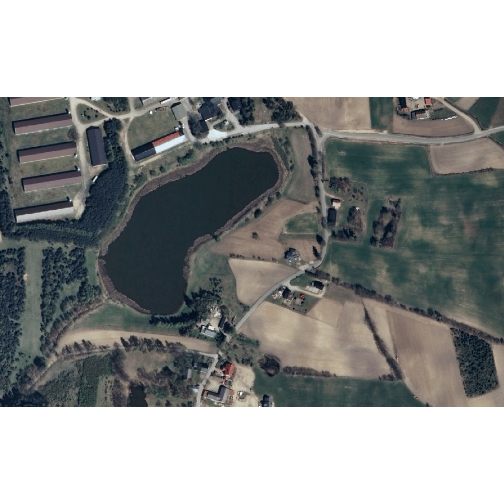
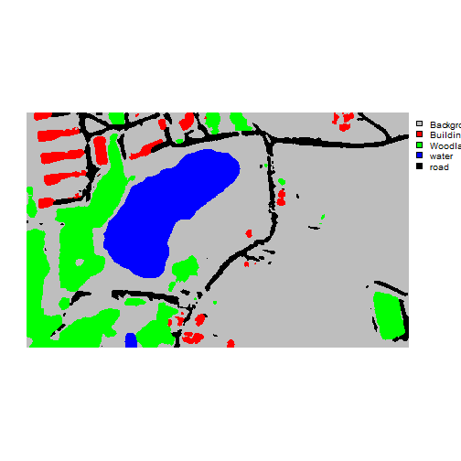
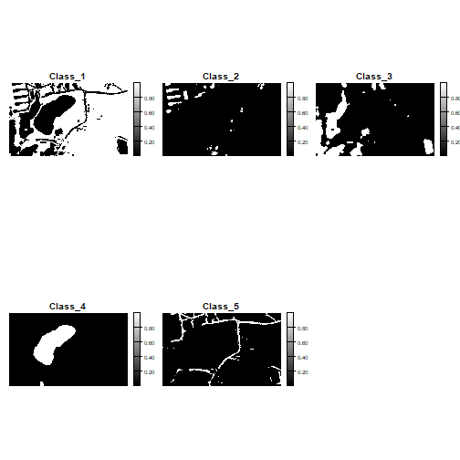

```{r setup, include=FALSE}
knitr::opts_chunk$set(echo=TRUE, comment="", collapse=TRUE, warning=FALSE, message=FALSE, fit.cap="")
```


```r
library(geodl)
library(dplyr)
library(torch)
library(luz)
```


```r
device <- torch_device("cuda")
```

This example shows how to use a trained model to predict to a spatial extent. The first component of the the example is replicated from the "Multiclass Classification Workflow (Landcover.ai)" demonstration since we are using the model trained in that example to now make inferences.

## Prepare Model

To review from the "Multiclass Classification Workflow (Landcover.ai)" demonstration, we must do the following:

1. Read in and prepare the list of chips.
2. Instantiate the DataSets and DataLoaders.
3. Re-instantiate the model using **luz** and load in the saved checkpoint.

The code below accomplishes these tasks.


```r
trainDF <- read.csv("C:/myFiles/data/landcoverai/train.txt", header=FALSE)
valDF <-  read.csv("C:/myFiles/data/landcoverai/val.txt", header=FALSE)
```


```r
trainDF <- data.frame(chpN=trainDF$V1,
                      chpPth=paste0("images/", trainDF$V1, ".tif"),
                      mskPth=paste0("masks/", trainDF$V1, "_m.tif")) |>
  sample_frac(1, replace=FALSE) |> sample_n(3000)


valDF <- data.frame(chpN=valDF$V1,
                    chpPth=paste0("images/", valDF$V1, ".tif"),
                    mskPth=paste0("masks/", valDF$V1, "_m.tif"))  |>
  sample_frac(1, replace=FALSE) |> sample_n(500)
```


```r
trainDS <- defineSegDataSet(
  chpDF=trainDF,
  folder="C:/myFiles/data/landcoverai/train/",
  normalize = FALSE,
  rescaleFactor = 255,
  mskRescale= 1,
  bands = c(1,2,3),
  mskAdd=1,
  doAugs = TRUE,
  maxAugs = 1,
  probVFlip = .5,
  probHFlip = .5,
  probBrightness = .1,
  probContrast = 0,
  probGamma = 0,
  probHue = 0,
  probSaturation = .2,
  brightFactor = c(.9,1.1),
  contrastFactor = c(.9,1.1),
  gammaFactor = c(.9, 1.1, 1),
  hueFactor = c(-.1, .1),
  saturationFactor = c(.9, 1.1))

valDS <- defineSegDataSet(
  chpDF=valDF,
  folder="C:/myFiles/data/landcoverai/val/",
  normalize = FALSE,
  rescaleFactor = 255,
  mskRescale = 1,
  mskAdd=1,
  bands = c(1,2,3),
  doAugs = FALSE,
  maxAugs = 0,
  probVFlip = 0,
  probHFlip = 0)
```


```r
length(trainDS)
[1] 3000
length(valDS)
[1] 500
```


```r
trainDL <- torch::dataloader(trainDS,
                             batch_size=15,
                             shuffle=TRUE,
                             drop_last = TRUE)

valDL <- torch::dataloader(valDS,
                           batch_size=15,
                           shuffle=FALSE,
                           drop_last = TRUE)
```


```r
fitted <- defineMobileUNet |>
  luz::setup(
    loss = defineUnifiedFocalLoss(nCls=5,
                                  lambda=0,
                                  gamma=.8,
                                  delta=0.5,
                                  smooth = 1,
                                  zeroStart=FALSE,
                                  clsWghtsDist=1,
                                  clsWghtsReg=1,
                                  useLogCosH =FALSE,
                                  device=device),
    optimizer = optim_adamw,
    metrics = list(
      luz_metric_overall_accuracy(nCls=5,
                                  smooth=1,
                                  mode="multiclass",
                                  zeroStart=FALSE,
                                  usedDS=FALSE),
      luz_metric_f1score(nCls=5,
                         smooth=1,
                         mode="multiclass",
                         zeroStart=FALSE,
                         clsWghts=c(1,1,1,1,1),
                         usedDS=FALSE),
      luz_metric_recall(nCls=5,
                        smooth=1,
                        mode="multiclass",
                        zeroStart=FALSE,
                        clsWghts=c(1,1,1,1,1),
                        usedDS=FALSE),
      luz_metric_precision(nCls=5,
                           smooth=1,
                           mode="multiclass",
                           zeroStart=FALSE,
                           clsWghts=c(1,1,1,1,1),
                           usedDS=FALSE)
    )
  ) |>
  set_hparams(
    nCls = 5,
    pretrainedEncoder = TRUE,
    freezeEncoder = FALSE,
    actFunc = "lrelu",
    useAttn = FALSE,
    useDS = FALSE,
    dcChn = c(256,128,64,32,16),
    negative_slope = 0.01
  ) |>
  set_opt_hparams(lr = 1e-3) |>
  fit(data=trainDL,
      valid_data=valDL,
      epochs = 0,
      callbacks = list(luz_callback_csv_logger("C:/myFiles/data/landcoverai/models/trainLogs.csv"),
                       luz_callback_model_checkpoint(path="C:/myFiles/data/data/landcoverai/models/",
                                                     monitor="valid_loss",
                                                     save_best_only=TRUE,
                                                     mode="min",
                       )),
      accelerator = accelerator(device_placement = TRUE,
                                cpu = FALSE,
                                cuda_index = torch::cuda_current_device()),
      verbose=TRUE)
```


```r
luz_load_checkpoint(fitted, "C:/myFiles/data/landcoverai/landcoveraiModel.pt")
```

## Infer to New Data

Spatial predictions can be made with the *predictSpatial()* function. There are three modes available, as defined with the *predType* parameter: "class", "prob", and "logit". When using the "class" mode the predicted class index is returned as a single-band categorical raster grid. When the "prob" mode is used, the predicted class probabilities, as estimated with the rescaled class logits, are returned as a multi-band raster grid where each band corresponds to a class. At a single cell location, all bands will sum to 1. For a multiclass classification, a softmax function is used to rescale the raw logits. A softmax function is also used for a binary classification where both the positive and background logits are predicted. If only the positive case logit is returned, a sigmoid activation is used. When the "logit" mode is used, the raw logits are returned as a multi-band raster grid without any rescaling.

Note that the input data need to be processed the same as the data used to train the model being applied. This is the purpose of the *normalize* and *rescaleFactor* parameters.

the *predictSpatial()* function breaks the larger extent into smaller extents, predicts each extent, then merging the results back to a single raster grid. The size of each extent is defined by the *chpSize* parameter. We generally recommend using the same chip size as the data used to train the model; however, this is not strictly necessary. The *sride_x* and *strid_y* parameters control the overlap between processing chips. We recommend using at least a 50% overlap. The *crop* parameter is used to remove the outer rows and columns of cells for each processed extent. It has generally been observed that the prediction accuracy on the margins of chips may be reduced due to the lack of a full set of neighbors. Applying a crop allows for not including these margin predictions in the final, merged output. For extents along the edge of the image, the outer margins are not cropped off so that the output has the same spatial extent and number of rows and columns of cells as the original image.

Inference can be performed much quicker on a GPU. So, we recommend using a GPU if one is available by setting the *useCUDA* parameter to TRUE. If you are running out of memory when making inferences, you may need to break the larger extent into smaller tiles for processing. We recommend saving the output as a .tif or .img file.

The examples below demonstrate making predictions to obtain the predicted classes and all class probabilities. I then plot the original image, the predicted classes, and the predicted class probabilities.


```r
predCls <- predictSpatial(imgIn="C:/myFiles/data/toChipMultiClass/multiclassLCAISub.tif",
                          model=fitted,
                          predOut="C:/myFiles/data/toChipMultiClass/predClass.tif",
                          mode="multiclass",
                          predType="class",
                          useCUDA=TRUE,
                          nCls=5,
                          chpSize=512,
                          stride_x=256,
                          stride_y=256,
                          crop=50,
                          nChn=3,
                          normalize=FALSE,
                          rescaleFactor=255,
                          usedDS=FALSE)
[1] "Processing 4 columns by 6 rows."
[1] "Prediction completed!"
```


```r
predProbs <- predictSpatial(imgIn="C:/myFiles/data/toChipMultiClass/multiclassLCAISub.tif",
                          model=fitted,
                          predOut="C:/myFiles/data/toChipMultiClass/predProbs.tif",
                          mode="multiclass",
                          predType="prob",
                          useCUDA=TRUE,
                          nCls=5,
                          chpSize=512,
                          stride_x=256,
                          stride_y=256,
                          crop=50,
                          nChn=3,
                          normalize=FALSE,
                          rescaleFactor=255,
                          usedDS=FALSE)
[1] "Processing 4 columns by 6 rows."
[1] "Prediction completed!"
```


```r
terra::plotRGB(terra::rast("C:/myFiles/data/toChipMultiClass/multiclassLCAISub.tif"))
```

{width=60%}


```r
terra::plot(predCls, type="classes",
            axes=FALSE,
            levels=c("Background", "Buildings", "Woodland", "water", "road"),
            col=c("gray", "red", "green", "blue", "black"))
```

{width=60%}


```r
terra::plot(predProbs, type="continuous",axes=FALSE, col=terra::map.pal("grey"))
```

{width=60%}
