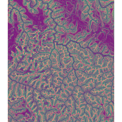

```{r setup, include=FALSE}
knitr::opts_chunk$set(echo=TRUE, comment="#>", collapse=TRUE, warning=FALSE, message=FALSE, fit.cap="")
```

```r
library(geodl)
library(terra)
```

The *makeTerrainDerivatives()* function creates a three-band raster stack from an input **digital terrain model** (**DTM**) of bare earth surface elevations. The first band is a **topographic position index** (**TPI**) calculated using a moving window with a 50 m circular radius.The second band is the square root of **slope** calculated in degrees. The third band is a TPI calculated using an annulus moving window with an inner radius of 2 meters and an outer radius of 5 meters. The TPI values are clamped to a range of -10 to 10 then linearly rescaled from 0 and 1. The square root of slope is clamped to a range of 0 to 10 then linearly rescaled from 0 to 1. Values are provided in floating point. This means of representing digital terrain data was proposed by Dr. Will Odom of the United States Geological Survey (USGS) and is discussed in the following publication, which is available in open-access:

Maxwell, A.E., W.E. Odom, C.M. Shobe, D.H. Doctor, M.S. Bester, and T. Ore, 2023. Exploring the influence of input feature space on CNN-based geomorphic feature extraction from digital terrain data, *Earth and Space Science*, 10: e2023EA002845. 

The code below provides an example of how to implement this function and visualize the output. The *dtm* argument must be either a spatRaster object or a path and file name for a DTM on disk. Note that the vertical units should be the same as the horizontal units. The *res* parameter is used to specify the spatial resolution of the DTM data, which is required for calculations implemented internally. The DTM used in the example has a spatial resolution of 2-by-2 meters. The output of this function is more meaningful for high spatial resolution digital terrain data (i.e., pixel sizes <= 5 m). The function returns the three-band raster as a spatRaster object and also writes the output to disk. We recommend saving the result to either a .tif or .img file.


```r
inDTM <- terra::rast("C:/myFiles/data/elev/dtm.tif")
```


```r
terrOut <- makeTerrainDerivatives(dtm=inDTM,
                                  res=2,
                                  filename="C:/myFiles/data/elev/tstack.tif")
[1] "Completed Slope."
[1] "Completed TPIs."
```

Since the output is a three-layer raster stack, it can be visualized using the *plotRGB()* function from the **terra** package. In the example, we multiply the data by 255 to rescale the values from 0 to 1 to 0 to 255, to mimic an 8-bit image.


```r
terra::plotRGB(terrOut*255)
```



If you are interested in applying deep learning semantic segmentation workflows to extract landforms or geomorphic features from DTMs, we recommend considering this three-band terrain stack as an input feature space.
